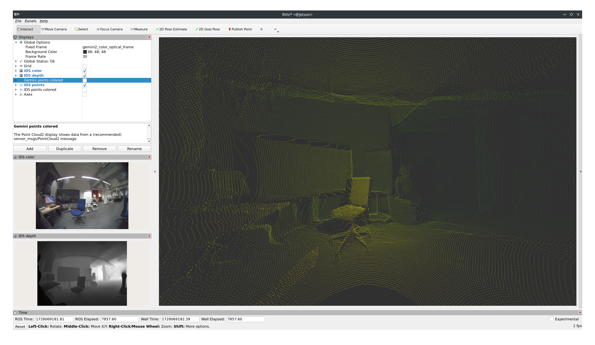
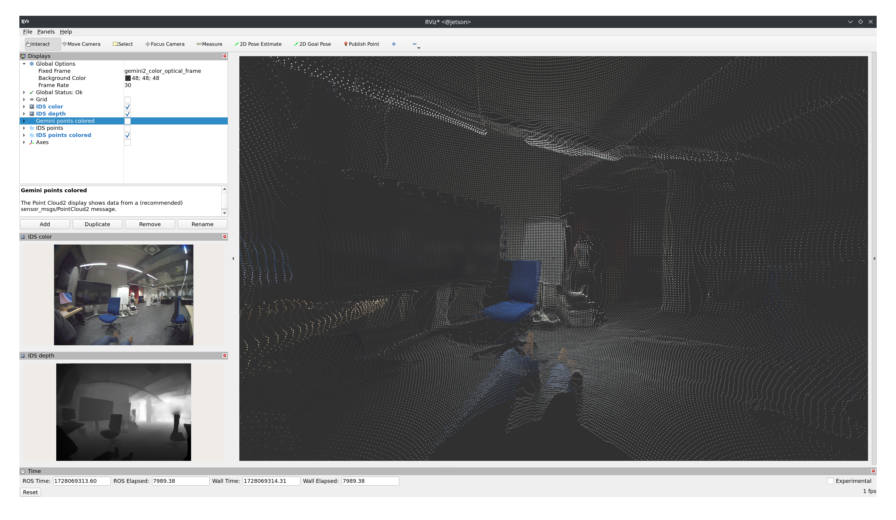
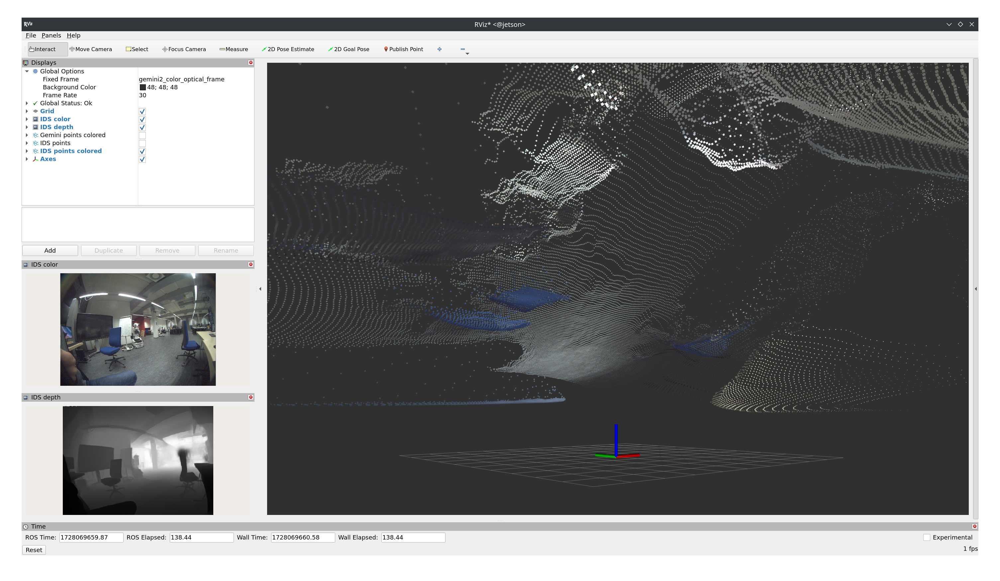
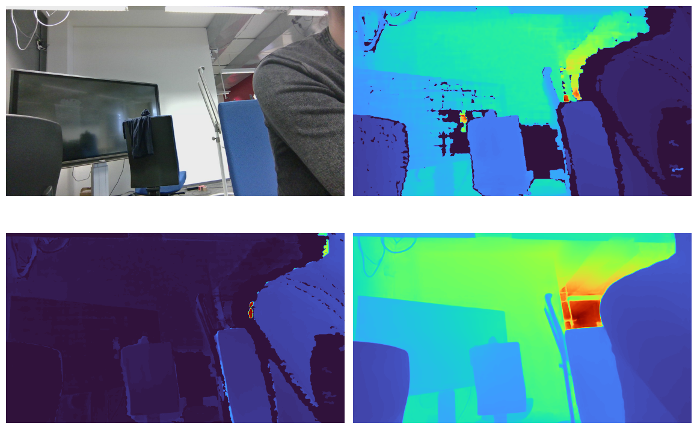

# ROS 2 Monocular Depth

ROS 2 package for monocular depth estimation using Depth Anything V2.

Note: This is a public, stripped-down version of a private repository. It may depend on other repositories which might not have a public version. Some paths, configurations, dependencies, have been removed or altered, so the code may not run out of the box.


*Figure 1: Real-time depth projection*


*Figure 2: Colored point cloud*

                                                                   *Figure 3: View from an orthogonal direction. The depth for the ground plane is not estimated accurately out of the box. Image rectification might mitigate this but the domain gap will still be large, since the model is not trained on images with very large FOV. Finetuning the model or applying some post-hoc transform might be worth considering.*

 *Figure 4: Rectification and comparison with measured depth from an active stereo IR camera. Top left: Raw image of fisheye lense camera rectified and transformed to the domain of the depth camera. Top right: Measured depth. Bottom right: Inferred depth. Bottom left: Absolute Relative Error (AbsRel).*

## Setup

```bash
git clone https://github.com/bertan-karacora/ros2_monocular_depth.git
cd ros2_monocular_depth
git submodule update --init --recursive
```

## Installation

### Build container

```bash
container/build.sh
```

## Usage

### Run in container

```bash
container/run.sh
```

## Links

- [Depth Anything V2](https://depth-anything-v2.github.io)
- [Depth Anything V2 with some upgrades](https://github.com/MackinationsAi/Upgraded-Depth-Anything-V2/tree/main)
- [Depth Anything V2 with TensorRT](https://github.com/spacewalk01/depth-anything-tensorrt)

## TODO

- Enable dynamic shapes when building TensorRT engines
